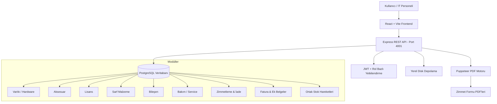

# DİTAŞ Otomotiv — Demirbaş Takip Sistemi Kapsamlı Proje Durum Raporu

**Proje Türü**: Kurumsal Envanter, Demirbaş, Lisans, Stok ve Zimmet Takip Sistemi  
**Teknoloji Yığını**: Node.js (ES Modules) + Express + Prisma ORM + PostgreSQL + Puppeteer / React + Vite + Tailwind CSS  
**Tasarım Dili**: DİTAŞ Kurumsal Kimliği (`#1E2534` Koyu Lacivert, `#F5F4EF` Krem, `#4F8FE0` Açık Mavi; IBM Plex Sans / Inter / Space Grotesk / IBM Plex Mono fontları)

---

## 📌 Genel Mimari ve Özellikler

> [!NOTE]
> Sistem tamamen yerel ağda (internet bağlantısız) çalışmak üzere tasarlanmıştır. Tüm faturalar, PDF belgeleri, görseller ve üretilen zimmet formları sunucunun yerel diskinde (`server/storage/`, `server/uploads/`) saklanır.

---

## 🚀 Tamamlanan Fazlar ve Modül Detayları

### 🔹 FAZ 0: Temel Altyapı (Kategori & Ek / Attachment Sistemi)
- **Dinamik Kategori Yönetimi**: `CategoryParentType` enum'ı (`Varlık`, `Aksesuar`, `Lisans`, `Sarf Malzeme`, `Bileşen`). Her ana türe özel alt kategoriler yönetilebilir.
- **Polimorfik Attachment (Ek Dosya) Sistemi**: Tüm varlık, aksesuar, lisans, sarf malzeme, bileşen ve zimmetlere fatura PDF/görselleri eklenebilir ve yerel sunucu diskinden güvenli şekilde indirilebilir.

---

### 🔹 FAZ 1: Varlık (Hardware) & Lisans (License) Modülleri
- **Hardware (Varlık)**: Masaüstü, Laptop, Monitör vb. varlıkların detaylı takibi.
  - **Yeni Alanlar**: `wifiMacAddress`, `location`, `supplier`, `invoiceNo`, `purchaseDate`, `purchaseAmount`, `specs` (CPU, RAM, GPU, Disk, DVD JSONB verisi).
  - **Durum Yönetimi**: `Hazır`, `Kullanımda`, `Arızalı`, `Serviste`, `Kullanım Dışı`.
  - **Barkod Sistemi**: Otomatik demirbaş barkodu oluşturma ve yazdırılabilir Barkod Modalı.
- **License (Lisans)**: Yazılım lisansları ve koltuk (seat) takibi.
  - `licenseKey`, `licensedTo`, `licensedEmail`, `totalQuantity`, `availableQuantity`, `assignedQuantity`, `endDate`.
  - **Günlük Cron Job**: Yaklaşan ve süresi dolan lisanslar için otomatik bildirim sistemi (`licenseExpiry.job.js`).

---

### 🔹 FAZ 2: Sarf Malzeme (Consumable), Bileşen (Component) & Ortak Stok Hareketleri
- **Ortak `stock_movements` Tablosu**: `accessory`, `consumable`, `component` ve `license` stok hareketleri tek polimorfik tabloda birleştirildi (`restock`, `issued`, `used_in_maintenance`, `assigned`, `mark_defective`).
- **Consumables (Sarf Malzeme)**: Toner, A4 kağıt, kablo vb. ürünlerin stok takibi.
  - `totalQuantity`, `availableQuantity`, `consumedQuantity`.
  - **Silme Koruması**: Tüketilmiş stoğu (`consumedQuantity > 0`) bulunan ürünler silinemez.
- **Components (Bileşen)**: RAM, SSD, Ekran Kartı vb. donanım bileşenlerinin stok takibi.
  - `totalQuantity`, `availableQuantity`, `usedQuantity`.
  - **Silme Koruması**: Kullanımda olan bileşenler silinemez.

---

### 🔹 FAZ 3: Bakım (Maintenance) Modülü
- Varlıklar (Hardware) sayfasına **gömülü alt modül** olarak tasarlandı (Ayrı navbar sekmesi yoktur).
- **Akıllı Durum Dönüşümü**:
  - Bakım başlatıldığında varlığın durumu otomatik olarak `'Serviste'` yapılır ve önceki durumu (`previousHardwareStatus`) kaydedilir.
  - Önceki durum `'Hazır'` veya `'Kullanımda'` ise bakım tamamlandığında varlık durumu **otomatik olarak ilk haline** döner (Zimmet kaydına dokunulmaz).
  - Önceki durum `'Arızalı'` ise bakım tamamlarken zorunlu olarak **Bakım Sonucu Durumu** (*Hazır / Arızalı / Kullanım Dışı*) seçtirilir.
- **Bileşen Montajı**: Bakıma parça/bileşen eklendiğinde bileşenin stoğu düşer, `usedQuantity` artar ve ortak `stock_movements` kaydı atılır.
- **Veri Güvenliği**: Bakım kayıtları **hiçbir şekilde silinemez** (DELETE endpoint'i yoktur).

---

### 🔹 FAZ 4a & 4b: Karma Zimmetleme, Otomatik PDF Üretimi & İmzalı Belge
- **Karma Zimmetleme (Varlık + Aksesuar + Lisans + Sarf Malzeme)**:
  - Tek bir zimmet işleminde 4 farklı ürün türü aynı anda kişiye zimmetlenebilir.
  - **%100 Transaction Bütünlüğü (Rollback)**: 'Hazır' olmayan bir varlık veya yetersiz stok durumunda tüm işlem geri alınır, hiçbir stok bozulmaz.
- **Sarf Malzeme Düşüm Yolları**:
  1. Zimmetleme esnasında kişiye verilerek.
  2. Sarf Malzeme sayfasından doğrudan zimmetsiz düşüm yapılarak (`POST /api/consumables/:id/issue`).
- **Puppeteer ile Otomatik PDF Üretimi**:
  - Zimmet oluşturulduğu anda DİTAŞ kurumsal A4 Zimmet Formu şablonu (`assignment-form.html`) doldurulur.
  - Bilgisayarların Donanım Parça Tablosu (*CPU, RAM, GPU, Disk, DVD, Diğer*) ve ek kalemler otomatik basılır.
  - `/api/assignments/:id/pdf` adresi üzerinden doğrudan indirilebilir.
- **Opsiyonel İmzalı Belge Yükleme**:
  - Islak imzalı zimmet formu taranıp `/api/assignments/:id/signed-form` adresiyle yüklenebilir. Yüklenmese de zimmet **"Aktif"** kalmaya devam eder.

---

## 📊 Modül Yetki Tablosu

| Modül / İşlem | Viewer (İzleyici) | IT Staff (IT Personeli) | Admin (Yönetici) |
| :--- | :---: | :---: | :---: |
| **Varlık Listeleme / Detay** | ✅ Görüntüler | ✅ Full Yetki | ✅ Full Yetki |
| **Barkod Yazdırma** | ✅ Görüntüler | ✅ Yazdırır | ✅ Yazdırır |
| **Aksesuar & Lisans Yönetimi** | ✅ Görüntüler | ✅ Ekle / Güncelle | ✅ Full Yetki |
| **Sarf & Bileşen Stok/Düşüm** | ✅ Görüntüler | ✅ Ekle / Düşüm Yap | ✅ Full Yetki |
| **Bakım İşlemleri & Parça Ekleme** | ✅ Görüntüler | ✅ Bakım Başlat/Tamamla | ✅ Full Yetki |
| **Karma Zimmet Oluşturma** | ✅ Görüntüler | ✅ Zimmetle | ✅ Full Yetki |
| **PDF İndirme / İmzalı Form Yükleme** | ✅ İndirir | ✅ İndirir / Yükler | ✅ Full Yetki |
| **Kullanıcı Yönetimi** | ❌ Erişemez | ❌ Erişemez | ✅ Full Yetki |

---

## 📋 Sıradaki Adımlar (Sonraki Fazlar)

1. **FAZ 4c**: Zimmet İade (Return) Altyapısı (Kısmi İade, Tam İade, İade PDF Formu Üretimi).
2. **FAZ 4d**: Zimmetleme ve İade Süreçlerinin Frontend Arayüz Bağlantıları.
3. **FAZ 5**: Dashboard ve Gelişmiş Raporlama / Grafikler.
